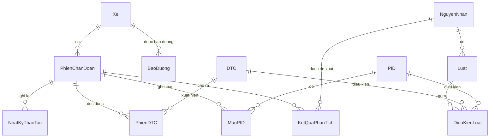

# ERD — CSDL phần mềm chẩn đoán lỗi cho xưởng

> Suy ra từ use-case UC01-UC11 (`USE-CASE.md`).
> Sơ đồ: `erd.drawio` (mở bằng draw.io). Script SQL Server: `../sql/01_tao_bang.sql` (tạo CSDL `ChanDoanXe` và 13 bảng), `../sql/02_seed_chua_xac_minh.sql` (nạp 12 DTC và 8 PID, tất cả đặt `DaXacMinh = 0`).

## 1. Các thực thể và thuộc tính

**Nhóm danh mục (nạp sẵn, ít thay đổi)**

| Bảng | Khóa chính | Cột chính | Phục vụ UC |
|---|---|---|---|
| `DTC` | `MaDTC` (vd P0300) | `MoTaGoc`, `MoTaViet`, `NhomHeThong`, `MucDo`, `Nguon` | UC05, UC10 |
| `PID` | `MaPID` (vd 0x0C) | `Ten`, `SoByte`, `CongThuc`, `DonVi`, `GiaTriMin`, `GiaTriMax`, `Nguon` | UC04 |
| `NguyenNhan` | `MaNN` | `TenNguyenNhan`, `GoiYKiemTra` | UC07 |
| `Luat` | `MaLuat` | `MaNN` (FK), `DiemTinCay`, `MoTa` | UC07 |
| `ChuKyBaoDuong` | `MaCK` | `HangMuc` (duy nhất), `ChuKyKm`, `ChuKyThang` (ít nhất một), `Nguon`; so khớp với `BaoDuong.HangMuc` khi tính hạn (không có khóa ngoại) | UC11 (nhắc bảo dưỡng) |
| `DieuKienLuat` | `MaDK` | `MaLuat` (FK), `Loai` (DTC hoặc PID), `MaDTC` (FK, có thể rỗng), `MaPID` (FK, có thể rỗng), `ToanTu`, `NguongGiaTri` | UC07 |

**Nhóm nghiệp vụ (phát sinh khi dùng)**

| Bảng | Khóa chính | Cột chính | Phục vụ UC |
|---|---|---|---|
| `Xe` | `MaXe` | `BienSo` (duy nhất), `Hang`, `DongXe`, `NamSanXuat`, `GhiChu`, `VIN` (17 ký tự, duy nhất khi có), `SoKmHienTai`, `ChuXe`, `SoDienThoai` | UC01, UC02 |
| `BaoDuong` | `MaBD` | `MaXe` (FK, không xóa dây chuyền), `NgayBaoDuong`, `SoKm`, `HangMuc`, `ChiPhi`, `GhiChu` | UC11 |
| `PhienChanDoan` | `MaPhien` | `MaXe` (FK), `ThoiGianBatDau`, `ThoiGianKetThuc`, `GhiChu` | UC05-UC09 |
| `PhienDTC` | (`MaPhien`, `MaDTC`) | `ThoiGianPhatHien` | UC05, UC08 |
| `MauPID` | `MaMau` | `MaPhien` (FK), `MaPID` (FK), `ThoiGian`, `GiaTriThuc` | UC04, UC07 |
| `KetQuaPhanTich` | `MaKQ` | `MaPhien` (FK), `MaNN` (FK), `DiemTinCay`, `ThuHang` | UC07 (đo top-1/top-3) |
| `NhatKyThaoTac` | `MaNK` | `MaPhien` (FK), `LoaiThaoTac` (DOC_DTC, XOA_DTC...), `ThoiGian`, `ChiTiet` | UC06, UC08 (tab Lịch sử) |

## 2. Quan hệ
- `Xe` 1 — n `PhienChanDoan`: một xe có nhiều phiên chẩn đoán.
- `Xe` 1 — n `BaoDuong`: một xe có nhiều lần bảo dưỡng (độc lập với phiên chẩn đoán).
- `PhienChanDoan` n — n `DTC` qua `PhienDTC`: một phiên đọc được nhiều mã, một mã xuất hiện ở nhiều phiên.
- `PhienChanDoan` 1 — n `MauPID`, và `PID` 1 — n `MauPID`.
- `PhienChanDoan` 1 — n `KetQuaPhanTich`, và `NguyenNhan` 1 — n `KetQuaPhanTich`.
- `PhienChanDoan` 1 — n `NhatKyThaoTac`.
- `NguyenNhan` 1 — n `Luat` 1 — n `DieuKienLuat`; mỗi điều kiện tham chiếu một `DTC` hoặc một `PID`.

## 3. Sơ đồ quan hệ (Mermaid, xem được trong VS Code bằng extension Markdown Preview Mermaid Support)

## 4. Quyết định thiết kế
1. **`MauPID` chỉ lưu một ảnh chụp** 8 PID tại lúc đọc DTC hoặc phân tích (8 dòng mỗi phiên), không lưu liên tục, để bảng không phình to.
2. **`DieuKienLuat` là bảng riêng** (hai khóa ngoại có thể rỗng: điều kiện theo mã lỗi hoặc theo PID) thay vì lưu biểu thức dạng chữ trong `Luat`: đúng chuẩn hóa và Java không phải tự phân tích biểu thức.
3. **Không có bảng người dùng**: ứng dụng chạy trên một máy của xưởng, không có chức năng đăng nhập.
4. **Danh mục `DTC`, `PID`** nạp từ `BANG-DTC-PID.xlsx`; nguồn đối chiếu ở `DOI-CHIEU-NGUON.md`.
5. **`Luat`, `NguyenNhan`** có nguồn cho từng luật ở `LUAT-CHAN-DOAN.md`.
