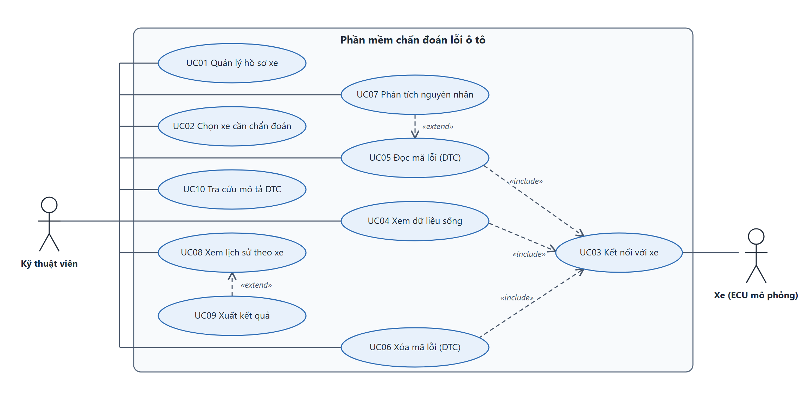

# Use-case — Phần mềm chẩn đoán lỗi cho xưởng dịch vụ

> Sơ đồ chỉnh sửa được: `use-case.drawio` (mở bằng draw.io). `use-case.png` / `use-case.svg` để chèn Word. `use-case.puml` là bản PlantUML dự phòng, bố cục kém gọn hơn.
>
> 

## 1. Tác nhân
| Tác nhân | Loại | Vai trò |
|---|---|---|
| **Kỹ thuật viên** | Chính | Người dùng phần mềm tại xưởng: chọn xe, chẩn đoán, xem lịch sử. |
| **Xe (ECU mô phỏng)** | Phụ (hệ thống ngoài) | Nhận yêu cầu OBD-II qua Gateway và trả dữ liệu sống, danh sách DTC. |

Quản lý xưởng, khách hàng, hóa đơn: **ngoài phạm vi** (đã chốt 05/10/2026).

## 2. Danh sách use-case
| Mã | Tên | Tác nhân | Ghi chú |
|---|---|---|---|
| UC01 | Quản lý hồ sơ xe | Kỹ thuật viên | Thêm, sửa, xóa xe (biển số, hãng, đời xe). Thao tác CSDL bảng `Xe`. |
| UC02 | Chọn xe cần chẩn đoán | Kỹ thuật viên | Bắt buộc trước khi chẩn đoán, để gắn kết quả vào đúng xe. |
| UC03 | Kết nối với xe | Kỹ thuật viên, Xe | Mở kết nối TCP tới Gateway trong máy ảo. |
| UC04 | Xem dữ liệu sống | Kỹ thuật viên, Xe | OBD-II Mode 01, 8 PID, hiện bằng đồng hồ và biểu đồ. |
| UC05 | Đọc mã lỗi (DTC) | Kỹ thuật viên, Xe | OBD-II Mode 03. |
| UC06 | Xóa mã lỗi (DTC) | Kỹ thuật viên, Xe | OBD-II Mode 04, có hộp xác nhận. |
| UC07 | Phân tích nguyên nhân | Kỹ thuật viên | Hệ chuyên gia gợi ý nguyên nhân kèm điểm tin cậy. Mở rộng của UC05. ĐÃ CÀI ĐẶT (06/10/2026): 17 nguyên nhân, 34 luật, xem `LUAT-CHAN-DOAN.md`. |
| UC08 | Xem lịch sử chẩn đoán theo xe | Kỹ thuật viên | Đọc bảng `PhienChanDoan` của xe đã chọn. |
| UC09 | Xuất kết quả chẩn đoán | Kỹ thuật viên | Ra file để lưu hoặc in. Mở rộng của UC08. |
| UC10 | Tra cứu mô tả DTC | Kỹ thuật viên | Xem mô tả mã lỗi trong danh mục (12 DTC). |
| UC11 | Quản lý lịch sử bảo dưỡng | Kỹ thuật viên | Thêm, sửa, xóa các lần bảo dưỡng của xe đang chọn (bảng `BaoDuong`), không cần kết nối xe. Thêm 06/10/2026. |

## 3. Quan hệ giữa các use-case
- **«include»:** UC04, UC05, UC06 đều bao gồm UC03 (cần kết nối trước). UC04, UC05, UC06 bao gồm UC02 qua điều kiện tiên quyết (xem 4).
- **Tác nhân phụ:** Xe (ECU mô phỏng) chỉ nối với UC03. Vì UC04, UC05, UC06 đều «include» UC03 nên Xe tham gia các use-case đó gián tiếp; vẽ vậy sơ đồ đỡ rối.
- **«extend»:** UC07 mở rộng UC05 (chỉ phân tích khi người dùng yêu cầu). UC09 mở rộng UC08.

## 4. Đặc tả chi tiết ba use-case chính

### UC05 — Đọc mã lỗi (DTC)
| Mục | Nội dung |
|---|---|
| Tác nhân | Kỹ thuật viên (chính), Xe (phụ) |
| Tiền điều kiện | Đã chọn xe (UC02) và đã kết nối (UC03). |
| Luồng chính | 1. Kỹ thuật viên bấm "Đọc DTC". 2. Hệ thống gửi yêu cầu Mode 03 tới Gateway. 3. Xe trả danh sách DTC. 4. Hệ thống đối chiếu từng mã với danh mục DTC để lấy mô tả và mức độ. 5. Hệ thống hiển thị bảng mã lỗi tô màu theo mức độ. 6. Hệ thống lưu kết quả thành một phiên chẩn đoán gắn với xe. |
| Luồng thay thế | 3a. Xe không có mã lỗi: hiển thị "Không có mã lỗi". 3b. Mất kết nối hoặc quá thời gian: báo lỗi, cho phép thử lại. 4a. Mã không có trong danh mục: hiển thị "Mã chưa có trong danh mục". |
| Hậu điều kiện | Phiên chẩn đoán được ghi vào CSDL; bảng DTC hiển thị. |

### UC06 — Xóa mã lỗi (DTC)
| Mục | Nội dung |
|---|---|
| Tiền điều kiện | Như UC05. Nên đã đọc DTC trước đó. |
| Luồng chính | 1. Bấm "Xóa DTC". 2. Hộp xác nhận hiện ra. 3. Kỹ thuật viên đồng ý. 4. Hệ thống gửi Mode 04. 5. Xe xác nhận. 6. Bảng DTC được làm trống. 7. Ghi một dòng vào lịch sử. |
| Luồng thay thế | 3a. Kỹ thuật viên hủy: không gửi gì. 5a. Xe không xác nhận: báo lỗi, giữ nguyên bảng. |
| Hậu điều kiện | DTC bị xóa trên xe; lịch sử có bản ghi. |
| Ghi chú báo cáo | OBD-II không bắt xác thực khi xóa DTC; đây là mục nêu trong phần giới hạn và an ninh. |

### UC07 — Phân tích nguyên nhân
| Mục | Nội dung |
|---|---|
| Tiền điều kiện | Đã chọn xe (UC02) và đã kết nối (UC03). |
| Luồng chính | 1. Bấm "Phân tích nguyên nhân". 2. Hệ thống đọc DTC (Mode 03) và chụp 8 PID. 3. Nạp luật từ CSDL. 4. Giữ các luật có mọi điều kiện đúng. 5. Gộp điểm tin cậy theo MYCIN (c = c1 + c2(1 - c1)) và xếp hạng. 6. Hiển thị nguyên nhân kèm gợi ý kiểm tra. 7. Lưu vào một phiên mới (PhienDTC, MauPID, KetQuaPhanTich, nhật ký PHAN_TICH). |
| Luồng thay thế | 4a. Không luật nào khớp: hiển thị "Chưa đủ cơ sở để kết luận". |
| Hậu điều kiện | Kết quả phân tích được lưu cùng một phiên mới (phục vụ đo top-1/top-3). |

## 5. Quyết định
- **UC10 giữ nguyên là use-case riêng**: tra mã khi chưa cắm xe là việc thợ hay gặp, và là một thao tác đọc CSDL.
- **Không có UC "Đăng nhập"**: ứng dụng chạy trên một máy của xưởng; nếu mở rộng sẽ cần thêm bảng người dùng và mật khẩu băm.
